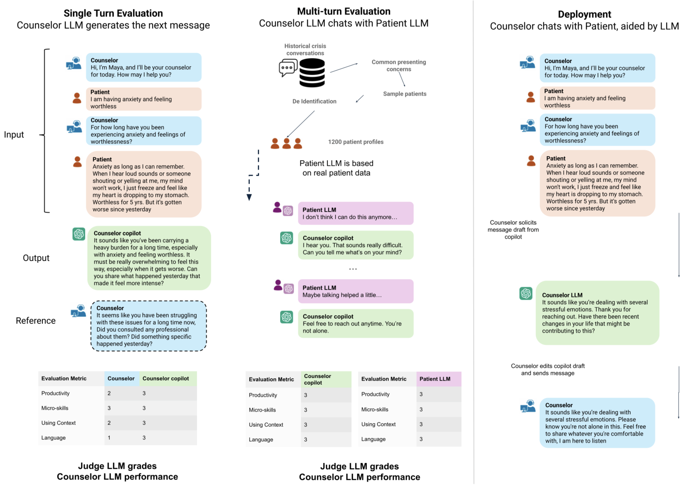

# CrisisBench: An Evaluation Suite for Crisis Counseling AI


<!-- Badges -->
<a href="https://github.com/framazan/CrisisBench"></a>&nbsp;
<a></a>&nbsp;
<a href="https://github.com/framazan/CrisisBench/blob/main/LICENSE"></a>

**CrisisBench** is a evaluation suite for large language models (LLMs) used in text-based crisis counseling. This repository contains tools for simulating crisis conversations, evaluating model performance across specific metrics, and de-identifying crisis transcript data.

The repository is organized into the following key components:

- `de_id/`: Scripts and utilities for de-identifying real-world crisis text transcripts while preserving context.
- `singleturn/`: Code to evaluate LLMs in single-turn conversational environments.
- `multiturn/`: Code to run and evaluate multi-turn dialogues between counselor systems and patient LLMs, by generating patient LLM profiles from real-world counseling text.
- `prompts/rubrics/`: Configuration files and yaml templates containing the rubrics used by the LLM judges. These are some of the most important innovations presented in the paper.
- `data/multiturn/patient_profiles/`: Templates and configurations for patient LLMs.
- `data/singleturn/for_prompting/`: Data inputs, outputs, and intermediate states for single-turn testing.
- `utils/`: Shared utilities for model prompting, file IO, and data processing.

## Quick Start

<!--quick-start-begin-->

To set up the environment, clone the repository and install the required dependencies using `pip`:

```sh
git clone https://github.com/framazan/CrisisBench.git
cd CrisisBench
pip install -r requirements.txt
```

Set up your `.env` file with the required API keys (e.g., `OPENAI_API_KEY`) to run the LLM judges.

### Usage Guide

CrisisBench provides two distinct frameworks for evaluating LLM counselors, depending on your needs. For step-by-step instructions on setting up datasets and running the pipelines, please refer to the detailed documentation linked below.

<p align="center">
  
</p>

#### Single-Turn Evaluation
The **Single-Turn Evaluation** tests how an LLM counselor responds to isolated, static crisis messages. It is designed to evaluate specific interventions (such as empathy, risk assessment, or active listening) on fixed message exchanges using message-level rubrics. This method is highly deterministic and lightweight.

For full instructions, see the [Single-Turn Evaluation Guide](docs/singleturn_evals.md).

#### Multi-Turn Evaluation
The **Multi-Turn Evaluation** framework simulates an entire crisis conversation by pairing your LLM counselor against an interactive LLM-based "patient agent." The patient is prompted with a detailed clinical profile (generated from real-world hotline data). After the simulated conversation concludes, an LLM Judge evaluates the full transcript against a comprehensive, conversation-level rubric. This method tests the counselor's ability to maintain context, de-escalate effectively, and build rapport over time. 

For full instructions, see the [Multi-Turn Evaluation Guide](docs/multiturn_evals.md).

#### Langfuse UI Integration
For tracking runs and evaluating traces, CrisisBench can integrate with Langfuse.
- [Langfuse UI Setup Guide](docs/langfuse_setup.md)
- [Langfuse UI Execution Guide](docs/langfuse_evals.md)

<!--quick-start-end-->

## Security and Privacy

For privacy and security reasons, real patient profiles derived from the hotline are **not included** in this open-source release. We provide dummy patient profiles located in `data/multiturn/patient_profiles/dummy_patient_profiles.yaml` that can be used to run and test the pipeline safely.

## Acknowledgements
We extend our deepest gratitude to the Vandrevala Foundation and their generous sponsors for providing the resources that made this analysis possible.

## Citation

If you use this software in your research, please cite our paper as below.

```bibtex
@article{
crisisbench2026,
title={CrisisBench: An Evaluation Suite for Crisis Counseling AI},
author={Akshay Swaminathan and Filip Ramazan and Sharang Phadke and Kevina Wang and Ivan Lopez and Shaked Peleg Azzam and Gloria Ye and Chastin Chung and William Wang and Stephanie Stoll and Ivy Pham and Rebecca Hurwitz and Shreya Shah and Divyanjali Verma and Abhay John and Ehsan Adeli and Samuel Chuang and Nigam Shah},
journal={arXiv preprint arXiv:[Placeholder]},
year={2026},
url={[Placeholder for URL]}
}
```

## License

MIT License
